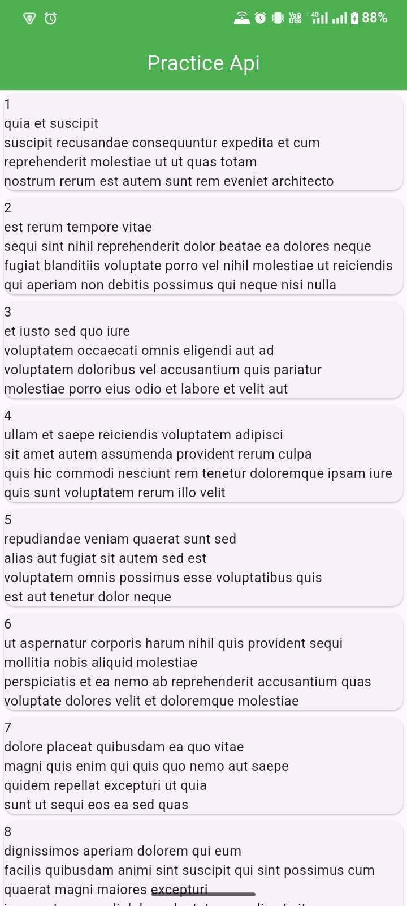
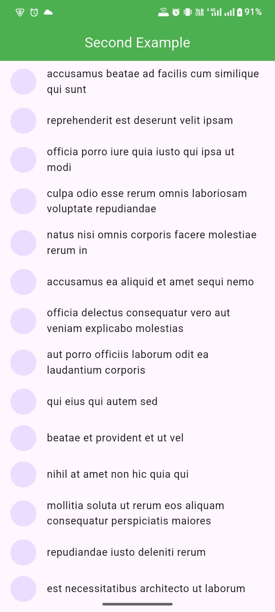

# 📱 Flutter API Practice

A Flutter practice project demonstrating REST API integration using `http` package and `FutureBuilder` for async data fetching and display.

---

## 📸 Screenshots

```
|  |  |
```

---

## ✨ Features

- Fetch and display data from public REST APIs
- Clean async data handling using `FutureBuilder`
- Display posts with title and body from [JSONPlaceholder](https://jsonplaceholder.typicode.com/posts)
- Display photos with thumbnail images from [JSONPlaceholder](https://jsonplaceholder.typicode.com/photos)
- Proper error and loading state handling
- Model class with `fromMap`, `toMap`, `copyWith`, and JSON serialization

---

## 🛠 Tech Stack

| Technology | Usage |
|---|---|
| Flutter | UI Framework |
| Dart | Programming Language |
| `http` package | REST API calls |
| `FutureBuilder` | Async UI rendering |
| JSONPlaceholder API | Fake REST API for practice |

---

## 📁 Project Structure

```
lib/
├── main.dart               # App entry point
├── practice_api.dart       # Posts API screen
├── example_two.dart        # Photos API screen
└── my_api_models/
    └── model_one.dart      # Apimodelone data model
```

---

## 🚀 Getting Started

### Prerequisites

- Flutter SDK `>=3.0.0`
- Dart SDK `>=3.0.0`
- Android Studio / VS Code with Flutter extension

### Installation

1. **Clone the repository**
   ```bash
   git clone https://github.com/your-username/flutter-api-practice.git
   cd flutter-api-practice
   ```

2. **Install dependencies**
   ```bash
   flutter pub get
   ```

3. **Run the app**
   ```bash
   flutter run
   ```

---

## 📦 Dependencies

```yaml
dependencies:
  flutter:
    sdk: flutter
  http: ^1.2.0
```

---

## 🔌 API Endpoints Used

| Endpoint | Description |
|---|---|
| `GET /posts` | Fetches list of posts (userId, id, title, body) |
| `GET /photos` | Fetches list of photos (title, url) |

Base URL: `https://jsonplaceholder.typicode.com`

---

## 📖 What I Learned

- Making HTTP GET requests in Flutter
- Parsing JSON responses into Dart model classes
- Using `FutureBuilder` to handle async states (loading, error, data)
- Building `ListView.builder` with dynamic API data
- Creating clean model classes with serialization methods

---


## 📄 License

This project is open source and available under the [MIT License](LICENSE).

---

## 👨‍💻 Author

**Your Name**
- GitHub: [maazkhan-tech](https://github.com/maazkhan-tech)
- LinkedIn: [Maaz Khan](www.linkedin.com/in/maaz-khan-5385bb386)